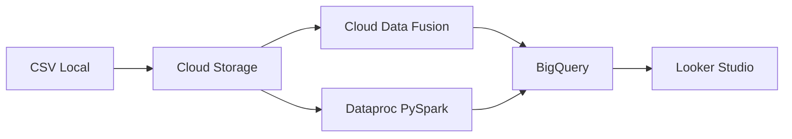

# **Arquitectura de Procesamiento Batch en GCP**  

**Descripción**: Este repositorio contiene los scripts y configuración para un pipeline de ETL en Google Cloud Platform (GCP) que procesa datos de ventas de automóviles.  

---

## **📌 Arquitectura**  


Este pipeline aprovecha múltiples servicios de GCP para permitir un flujo de datos eficiente, desde archivos CSV locales hasta visualizaciones interactivas.  

---

## **🧰 Servicios Utilizados y Descripción**  

### **1. Cloud Storage (GCS)**  
- **Descripción**: Almacenamiento escalable de objetos. Aquí se sube el archivo `autodata.csv`.  
- **Características**: Alta durabilidad, fácil integración con otros servicios GCP, control de versiones.  
- **Costo aproximado**: $0.026 por GB almacenado al mes (Standard).  

### **2. Cloud Data Fusion**  
- **Descripción**: Herramienta visual de integración de datos para construir pipelines ETL sin necesidad de código extensivo.  
- **Uso en este proyecto**: Se utilizó para probar transformaciones de datos sin escribir código, y para contrastar su facilidad de uso frente a Dataproc.  
- **Costo aproximado**: Desde $1.80 por hora de instancia básica (Developer Edition).  
- **Ventaja**: Ideal para usuarios no técnicos y para orquestación rápida de ETL visualmente.  

### **3. Dataproc (PySpark)**  
- **Descripción**: Servicio de procesamiento distribuido basado en Apache Spark.  
- **Uso en este proyecto**: Transformación de datos en paralelo usando PySpark (limpieza, cálculo de métricas, particionamiento).  
- **Comando de ejecución desde Cloud Shell**:  
```bash
gcloud dataproc jobs submit pyspark     --cluster=mi-cluster-spark     --region=us-central1     --jars=gs://spark-lib/bigquery/spark-bigquery-with-dependencies_2.12-0.36.1.jar     --properties=spark.submit.deployMode=cluster     --service-account=dataproc-service-account@bigdata-batch-demo.iam.gserviceaccount.com     gs://auto-sales-bigdata/scripts/data_processing-dataproc.py
```
- **Costo aproximado**: ~$0.01 a $0.10 por hora por nodo, dependiendo del tipo de máquina.  

### **4. BigQuery**  
- **Descripción**: Almacén de datos altamente escalable y sin servidor. Se utiliza SQL estándar para consultar los datos.  
- **Características**: Particionamiento por fecha (`ORDERDATE`), clustering por categoría (`DEAL_CATEGORY`), consultas rápidas a gran escala.  
- **Costo aproximado**:  
  - Almacenamiento: ~$0.02 por GB por mes.  
  - Consultas: ~$5 por TB procesado (primeros 1 TB/mes gratis).  

### **5. Looker Studio**  
- **Descripción**: Herramienta gratuita de visualización de datos. Permite crear dashboards conectados directamente a BigQuery.  
- **Costo**: Gratuito.  

---

## **⚙️ Configuración**  

### **1. Requisitos**  
- Cuenta en GCP con facturación habilitada.  
- Proyecto GCP con estos servicios activados:  
  - Cloud Storage  
  - Cloud Data Fusion  
  - Dataproc  
  - BigQuery  
- Python 3.8+ y librerías:  
  ```bash
  pip install pandas google-cloud-storage pyspark
  ```

### **2. Archivos Clave**  
| Archivo | Descripción |  
|---------|-------------|  
| [`clean_data_fusion.py`](./clean_data_fusion.py) | Limpieza inicial del dataset (local). Soluciona un problema en Data Fusion con delimitadores de coma. |  
| [`Load-GCS.py`](./Load-GCS.py) | Establece conexión y carga de datos a Cloud Storage. |  
| [`data_processing-dataproc.py`](./data_processing-dataproc.py) | Script PySpark usado en Dataproc con conexión a BigQuery. |  

---

## **🚀 Ejecución**  

### **1. Cargar Datos a GCS**  
```bash
python Load-GCS.py
```
**Salida esperada**:  
```
Archivo data/subset_limpio.csv subido a gs://auto-sales-bigdata/autodata.csv
```

### **2. Procesar con Dataproc**  
```bash
gcloud dataproc jobs submit pyspark     --cluster=mi-cluster-spark     --region=us-central1     --jars=gs://spark-lib/bigquery/spark-bigquery-with-dependencies_2.12-0.36.1.jar     --properties=spark.submit.deployMode=cluster     --service-account=dataproc-service-account@bigdata-batch-demo.iam.gserviceaccount.com     gs://auto-sales-bigdata/scripts/data_processing-dataproc.py
```
**Transformaciones aplicadas**:  
- Conversión de fechas (`ORDERDATE`).  
- Cálculo de valor total (`TOTAL_ORDER_VALUE`).  
- Clasificación por tamaño de venta (`DEAL_CATEGORY`).  

---

## **📊 Resultados en BigQuery**  
Consulta de prueba:  
```sql
SELECT * FROM `bigdata-batch-demo.autodataset.sales_processed` LIMIT 10;
```
- **Particionamiento**: Por `ORDERDATE`.  
- **Clustering**: Por `DEAL_CATEGORY`.  
- **Consultas**: Usando SQL estándar (SELECT, JOIN, GROUP BY, etc.).  


**🔗 Más recursos**:  
- [Documentación de Cloud Data Fusion](https://cloud.google.com/data-fusion/docs)  
- [Documentación de Dataproc](https://cloud.google.com/dataproc)  
- [Guía de BigQuery](https://cloud.google.com/bigquery/docs)  
